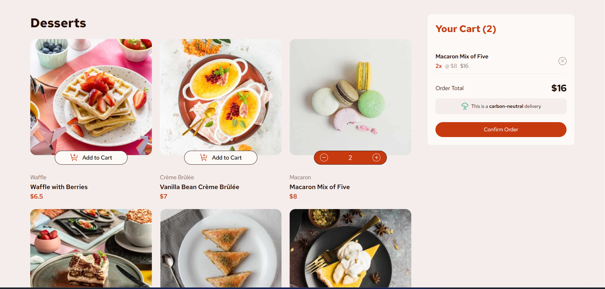

# Product List

## Table of contents

- [Overview](#overview)
  - [The challenge](#the-challenge)
  - [Screenshot](#screenshot)
  - [Built with](#built-with)
  - [What I learned](#what-i-learned)
- [Author](#author)

## Overview

A product list website displays items fetched dynamically from an API and presents them in a clear, structured layout.
It includes a cart-based ordering system that allows users to add products, manage quantities, and place orders efficiently.

### The challenge

Users should be able to:

- View the optimal layout for the app depending on their device's screen size
- See hover states for all interactive elements on the page
- Generate a new piece of advice by clicking the dice icon

### Screenshot

### Built with

- Semantic HTML5 markup
- CSS custom properties
- Flexbox
- CSS Grid
- Mobile-first workflow
- javascript

### What I learned

I learned how to fetch data from an API and display products dynamically on the page.
I also learned how to build a cart system that adds items, updates quantities, and manages the order state using JavaScript.

## Author

- x - [@Adem07077](https://x.com/Adem07077)
